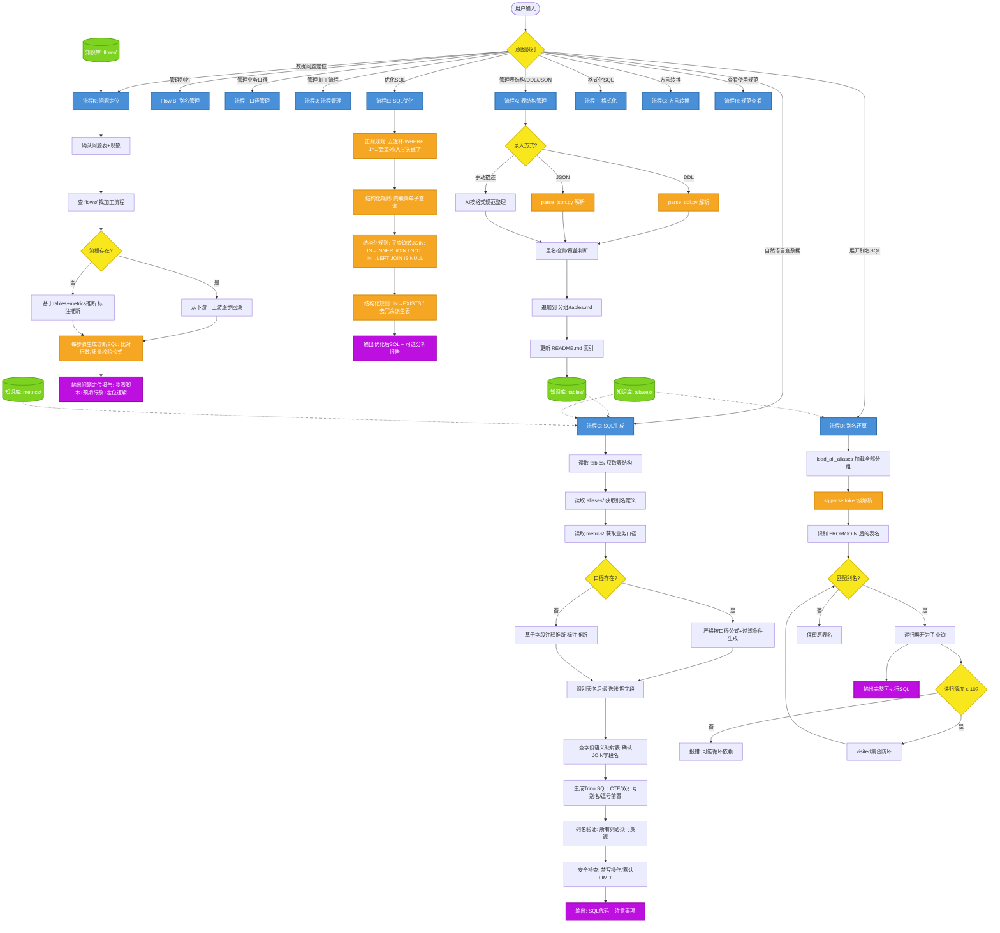

# SQL 智能助手技能详解

> 技能名称：`sql-assistant`
> 技能定位：基于本地知识库的 Trino/Hive SQL 生成与管理工具
> 适用场景：数据开发、数据分析等领域的 SQL 编写、优化、方言转换与数据问题定位

---

## 一、定位与核心理念

SQL 智能助手是一个**基于本地知识库的 Trino/Hive SQL 生成与管理工具**，服务于数据开发与数据分析场景。核心理念是：

> **不让 AI 自由发挥，而是用知识库约束 + 脚本确定性处理来保证输出质量**

所有列名必须来自已注册的表结构，所有业务指标的 WHERE 条件必须来自已录入的口径定义，格式决策由脚本保证而非 AI 手写。

这种"确定性优先"的设计使得技能输出具备以下特点：

- **可追溯**：每个列名都能溯源到知识库中的表结构定义
- **可复现**：相同输入产生相同格式输出，格式由脚本保证
- **可约束**：业务口径约束 WHERE 条件，禁止 AI 自行推断
- **安全**：强制账期过滤防全表扫描，禁写操作语句

---

## 二、主要功能（11 条流程）

技能通过**意图识别表**将用户请求路由到 11 条流程，可归为四大类：

### 类别一：知识库管理（输入侧）

| 流程 | 名称 | 作用 |
|------|------|------|
| A | 表结构管理 | 三种方式录入：粘贴 DDL、导入数据平台 JSON、手动描述。脚本自动解析并落盘 |
| B | 别名管理 | SQL 片段的命名引用，支持 L1→L2→L3 分层复用 |
| I | 业务口径管理 | 指标的标准定义（计算公式+过滤条件+依赖表），SQL 生成时必须引用 |
| J | 加工流程管理 | 表到表的转换链路记录，是问题定位的基础 |

### 类别二：SQL 生成与处理（核心侧）

| 流程 | 名称 | 作用 |
|------|------|------|
| C | SQL 生成 | 自然语言→Trino SQL，查知识库取列名/口径，强制账期过滤 |
| D | 别名还原 | 递归展开别名引用为完整可执行 SQL |
| E | SQL 优化 | 规则引擎：去注释、内联子查询、IN→JOIN、去冗余派生表 |
| F | SQL 格式化 | 三种风格：standard / compact / expanded |
| G | 方言转换 | MySQL ↔ Trino ↔ Doris 双向转换（6 个方向） |

### 类别三：规范与诊断（输出侧）

| 流程 | 名称 | 作用 |
|------|------|------|
| H | 使用规范 | 别名命名规范、分组策略、分层架构、字段语义映射 |
| K | 问题定位 | 基于加工流程逐步回溯，生成诊断 SQL，输出问题定位报告 |

### 意图识别路由表

| 用户意图 | 走流程 | 参考资源 |
|---------|--------|---------|
| 录入/查看/管理表结构 | A: 表结构管理 | `references/tables/`（按分组存储） |
| 录入/查看/管理别名 | B: 别名管理 | `references/aliases/`（按分组存储） |
| 录入/查看/管理业务口径 | I: 业务口径管理 | `references/metrics/`（按分组存储） |
| 录入/查看/管理加工流程 | J: 加工流程管理 | `references/flows/`（按分组存储） |
| 数据问题定位/排查 | K: 问题定位 | `references/flows/` + `references/tables/` + `references/metrics/` |
| 自然语言→生成SQL | C: SQL生成 | `references/tables/` + `references/aliases/` + `references/metrics/` |
| 还原别名SQL | D: 别名还原 | `scripts/alias_resolver.py` |
| 优化SQL | E: SQL优化 | `scripts/sql_optimizer.py` |
| 格式化SQL | F: SQL格式化 | `scripts/sql_formatter.py` |
| 方言转换 | G: 方言转换 | `scripts/sql_converter.py` + `references/dialect-mappings.md` |
| 使用规范/最佳实践 | H: 查看规范 | `references/best-practices.md` |

---

## 三、底层处理逻辑

### 3.1 四层架构

```
┌─────────────────────────────────────────┐
│  用户输入（自然语言 / SQL / DDL / JSON）   │
└──────────────────┬──────────────────────┘
                   ▼
┌─────────────────────────────────────────┐
│  意图识别层                               │
│  11 条流程路由（A~K）                     │
└──────┬───────────┬───────────┬──────────┘
       ▼           ▼           ▼
┌──────────┐ ┌──────────┐ ┌──────────┐
│ 知识库层  │ │ 脚本引擎  │ │ 规则参考  │
│ (4库并行) │ │ (6脚本)  │ │ (4参考)  │
└──────────┘ └──────────┘ └──────────┘
       ▼           ▼           ▼
┌─────────────────────────────────────────┐
│  输出层：SQL代码 + 注意事项 + 诊断报告     │
└─────────────────────────────────────────┘
```

### 3.2 知识库层（4 个并行存储）

所有知识库均按**业务分组**的 `子文件夹/*.md` 结构存储，AI 按需读取对应分组，避免全量加载。

| 知识库 | 存储路径 | 存储内容 | 索引文件 |
|--------|---------|---------|---------|
| 表结构 | `references/tables/{分组}/tables.md` | 字段名、类型、注释、枚举值、分区字段、维度关联 | `references/tables/README.md` |
| 别名 | `references/aliases/{分组}/aliases.md` | SQL片段 + 列定义 + 依赖声明（表/别名） | `references/aliases/README.md` |
| 业务口径 | `references/metrics/{分组}/metrics.md` | 指标名 + 定义 + 计算公式 + 依赖表 + 过滤条件 + 账期 | `references/metrics/README.md` |
| 加工流程 | `references/flows/{分组}/flows.md` | 步骤表格 + 完整SQL文件路径 + 质量校验公式 | `references/flows/README.md` |

**分组管理规则**（四库一致）：

- 用户未指定分组时，默认存入 `default/`，AI 不得自行创建新分组
- 只有用户明确指定新分组名时，才创建新分组文件夹
- 删除分组/删除表/删除别名等操作必须经用户确认后执行，不可恢复

### 3.3 脚本引擎层（6 个 Python 脚本）

脚本负责确定性处理，所有格式决策由脚本保证，AI 不做格式决策。

| 脚本 | 底层依赖 | 核心能力 |
|------|---------|---------|
| `parse_json.py` | 标准库 | 解析数据平台 JSON 元数据，自动提取表名/字段/分区/枚举/维度关联；支持批量导入、BOM容错、水印剥离、重名检测；`--group --append` 直接落盘+更新索引 |
| `parse_ddl.py` | 标准库 | 解析 Trino/Hive DDL，支持 COMMENT、PARTITIONED BY、嵌套类型（array/map/decimal）；按 `;` 拆分多条 DDL；参数与 parse_json.py 对齐 |
| `alias_resolver.py` | sqlparse | token 级解析，精确识别 FROM/JOIN 后的表名，递归展开别名（最大10层），visited 集合防循环依赖，大小写不敏感匹配，`_` 后缀兼容 |
| `sql_optimizer.py` | sqlparse | 正则规则（去注释/WHERE 1=1/去重列/大写关键字）+ 结构化规则（内联子查询/子查询转JOIN/IN→EXISTS/去冗余派生表）；支持 `--analyze` 分析报告 |
| `sql_formatter.py` | sqlparse | 三种风格格式化：standard（标准缩进）、compact（单行紧凑）、expanded（每关键字独占一行） |
| `sql_converter.py` | 标准库 | 基于映射表做函数名/分页语法/日期提取函数的双向转换，支持 MySQL↔Trino↔Doris 共6个方向 |

### 3.4 规则参考层（4 个参考文件）

| 参考文件 | 内容 |
|---------|------|
| `references/trino-reference.md` | Trino SQL 语法速查（字符串、日期、聚合、窗口、条件、数组、JSON） |
| `references/optimization-rules.md` | SQL 优化规则详解（正则规则优先级表 + 结构化优化规则示例） |
| `references/dialect-mappings.md` | 方言转换映射表（通用函数差异、日期提取函数差异、分页语法差异） |
| `references/best-practices.md` | 使用规范与最佳实践（别名命名、分组策略、编写规范、分层架构、依赖管理、字段语义映射） |

### 3.5 核心约束机制

AI 生成 SQL 时受到多重约束保障质量：

1. **列名溯源**：所有列名必须来自知识库已注册的表/别名，禁止编造；若找不到则主动告知用户并建议录入
2. **口径优先**：涉及业务指标时，先查 `metrics/`，有口径则严格按口径生成 WHERE 条件和计算公式；无口径则基于字段注释推断但标注 `[推断]` 提醒确认
3. **账期强制**：表名 `_D` 后缀→自动用 `stat_date`（YYYYMMDD），`_M` 后缀→自动用 `stat_month`（YYYYMM），禁止全表扫描；相对时间用 `format_datetime` 生成
4. **安全锁**：禁止生成 DROP/DELETE/UPDATE/INSERT/DDL 语句，默认加 `LIMIT 1000`
5. **字段语义映射**：多表 JOIN 前必须查 `best-practices.md` 第六节确认字段名，不可假设同名（如计费侧 `L_C_SO_FEE` vs 经分侧 `L_C_FAV_FEE`）
6. **基础表数据特性**：基础表存全量快照非增量，日表 T-1 更新，月表 T-1 月更新，取"最新数据"用 T-1 账期

---

## 四、底层处理流程图



---

## 五、核心流程详解

### 5.1 流程 C：SQL 生成（最核心流程）

```
1. 读取知识库：tables/（表结构）+ aliases/（别名定义）+ metrics/（业务口径）
2. 分析用户问题：识别涉及的表/别名、字段、筛选条件、聚合需求
3. 口径优先判断：
   - 若用户问题涉及已知业务口径 → 从 metrics/ 获取口径定义
   - 按口径中的计算公式和过滤条件生成 SQL，不可自行编造 WHERE 条件
4. 账期字段选择：
   - 表名以 _D 结尾 → stat_date (YYYYMMDD)
   - 表名以 _M 结尾 → stat_month (YYYYMM)
5. 字段语义映射：多表JOIN前查 best-practices.md 第六节确认字段名
6. 生成 Trino SQL：
   - 中文别名用双引号：SELECT col1 AS "用户数"
   - 优先使用 CTE 组织复杂查询
   - 表名带 schema 前缀
   - 账期字段优先用于过滤
   - 大表查询必须加 LIMIT 或账期过滤
7. 列名验证：检查 SQL 中引用的列名是否在表结构或别名定义中存在
8. 输出：SQL 代码 + 逻辑说明 + 注意事项提醒
```

**输出格式**：每次生成 SQL 后输出两部分——SQL 代码 + 注意事项（账期过滤、数据量提醒、未找到的列/表、性能风险、语义确认、近似函数、空值风险等，无则省略）。

### 5.2 流程 K：问题定位

```
触发场景："XX表数据有问题"、"汇总数不对/少了/多了"、"上下游对不上"、"XX指标异常"

定位流程：
1. 确认问题表和现象：明确哪张表、哪个字段、什么异常（偏多/偏少/缺失/重复）
2. 查找加工流程：在 flows/ 中搜索涉及该下游表的加工流程
3. 逐层生成诊断 SQL：从下游→上游逐步回溯，每个步骤生成一段比对 SQL
4. 输出诊断脚本：所有诊断 SQL 按"从上游到下游"顺序排列，用户逐步执行定位

降级策略：若问题表没有对应的加工流程记录，AI 基于表结构和业务口径
         手动推断生成临时诊断 SQL，标注 [推断] 提示用户确认
```

---

## 六、适用用例 Query

以下 5 个用例覆盖了技能的核心流程：

### 用例1（流程C — 自然语言转SQL + 口径约束）

```
帮我查上月出账稽核计费侧与经分侧C网收入差异超过100元的账户明细，按差异金额降序排列
```

> 触发逻辑：检索 `metrics/` 获取"C网收入"口径 → 查 `tables/` 确认计费侧 `L_C_SO_FEE` / 经分侧 `L_C_FAV_FEE` 字段 → 查字段语义映射表确认镜像字段 → 生成带 `stat_month` 账期过滤的 Trino SQL

### 用例2（流程A+J — 批量建知识库 + 录入加工链路）

```
我把出账稽核的6张上游表的JSON元数据放在 D:\assets 目录下，帮我批量导入到"出账稽核"分组，
然后把jfph_diff的3段加工SQL录成一个加工流程
```

> 触发逻辑：`parse_json.py --file D:\assets --group 出账稽核 --append` 批量落盘 → 整理3段SQL为标准加工流程格式（步骤表格+完整SQL文件路径+质量校验公式）→ 追加到 `flows/出账稽核/flows.md`

### 用例3（流程K — 数据问题定位）

```
INT_JFPH_DIFF_M 表这个月的 ALL_DIFF_FEE 汇总比预期少了大概3万，帮我定位问题出在哪一步
```

> 触发逻辑：查 `flows/` 找到 `jfph_diff_m` 加工流程（3步UNION→JOIN→差异计算）→ 从下游→上游逐步生成3段诊断SQL → 输出问题定位报告，含每步预期行数和定位逻辑

### 用例4（流程D+E+F — 别名还原→优化→格式化一条龙）

```
我写了这个查询用了别名，帮我先展开成完整SQL，然后优化一下，最后用标准风格格式化
SELECT a.acct_id, a.all_diff_fee FROM jfph_diff a WHERE a.stat_month = '202606'
```

> 触发逻辑：`alias_resolver.py` 递归展开 `jfph_diff` 别名为子查询 → `sql_optimizer.py` 做规则优化（内联/去冗余）→ `sql_formatter.py --style standard` 格式化输出

### 用例5（流程G — 方言转换）

```
我有一段MySQL的查询，帮我转成Trino语法：
SELECT IFNULL(amount, 0), YEAR(create_date), COUNT(DISTINCT user_id) FROM orders LIMIT 20, 10
```

> 触发逻辑：`sql_converter.py --from mysql --to trino` → `IFNULL`→`COALESCE`、`YEAR()`→`EXTRACT(YEAR FROM )`、`LIMIT 20,10`→`OFFSET 20 LIMIT 10` → 输出转换结果并提醒人工确认语义

---

## 七、资源文件清单

| 路径 | 用途 |
|------|------|
| `references/tables/` | 表结构知识库（按分组存储） |
| `references/aliases/` | 别名知识库（按分组存储） |
| `references/metrics/` | 业务口径知识库（按分组存储） |
| `references/flows/` | 加工流程知识库（按分组存储） |
| `references/trino-reference.md` | Trino SQL 语法速查 |
| `references/optimization-rules.md` | SQL 优化规则详解 |
| `references/dialect-mappings.md` | 方言转换映射表 |
| `references/best-practices.md` | 使用规范与最佳实践 |
| `scripts/parse_ddl.py` | DDL 解析工具 |
| `scripts/parse_json.py` | 数据平台 JSON 解析工具 |
| `scripts/alias_resolver.py` | 别名递归还原引擎 |
| `scripts/sql_optimizer.py` | SQL 优化引擎 |
| `scripts/sql_formatter.py` | SQL 格式化器 |
| `scripts/sql_converter.py` | 方言转换器 |

---

## 八、全局注意事项

以下注意事项适用于所有流程，执行任何操作前都应遵守：

### 知识库完备性

- SQL 生成前必须确认已录入相关表结构，知识库为空时应提醒用户先录入
- 用户问题中提到的表/字段在知识库中找不到时，不得编造，应主动告知并建议录入

### 大小写与命名

- Trino 对标识符大小写不敏感（除非用双引号包裹），但建议表名、列名统一小写
- Hive 表名不区分大小写：流程定义中的 `user_orders_m` 与知识库中的 `USER_ORDERS_M` 是同一张表
- 分组名不可重复，建议用英文小写 + 下划线
- 别名命名遵循 `{业务模块}_{查询类型}` 规范

### 字段语义映射

- 多表 JOIN 时同一语义可能对应不同字段名（如系统A `amount` vs 系统B `fee`），必须先查 `best-practices.md` 第六节确认
- 新增表时若发现字段名与映射表已有语义冲突，须同步更新映射表

### 文件操作安全

- 知识库文件可能被多个会话同时编辑，保存前应先读取最新内容再追加，避免覆盖
- 所有删除操作必须经用户确认后执行，不可恢复
- 修改操作建议在对话中说明改了什么，方便用户追溯

### 账期字段约定（全局通用）

| 表名后缀 | 账期字段 | 类型 | 格式 | 更新时间 |
|---------|---------|------|------|---------|
| `_D`（日表） | `stat_date` | string | YYYYMMDD | T-1 天 |
| `_M`（月表） | `stat_month` | string | YYYYMM | T-1 月 |

生成 SQL 时，取"最新数据"应使用 T-1 账期，而非 `CURRENT_DATE`；除非用户明确指定具体日期。

### 脚本依赖

- `alias_resolver.py`、`sql_optimizer.py`、`sql_formatter.py` 依赖 `sqlparse` 库，首次使用需 `pip install sqlparse`
- `sql_converter.py`、`parse_ddl.py`、`parse_json.py` 仅依赖标准库，无需额外安装
